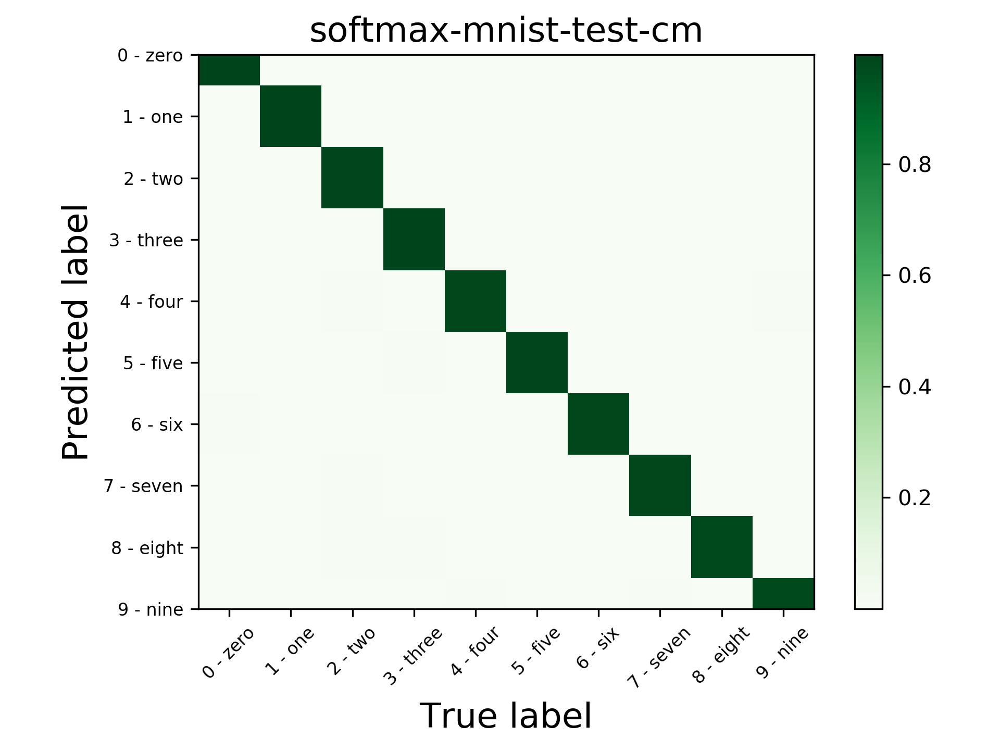
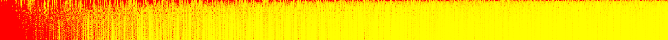
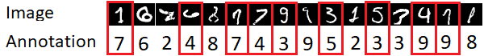
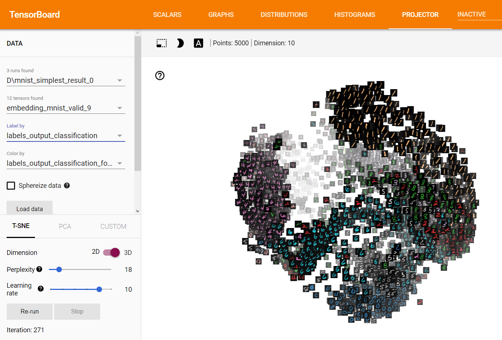
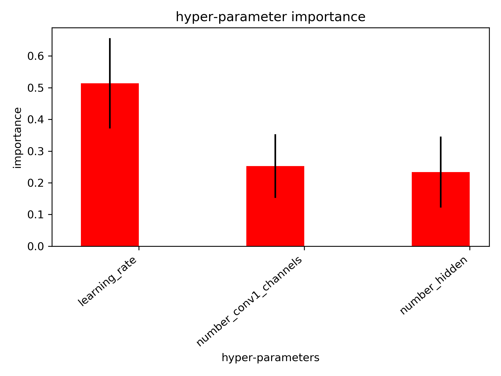
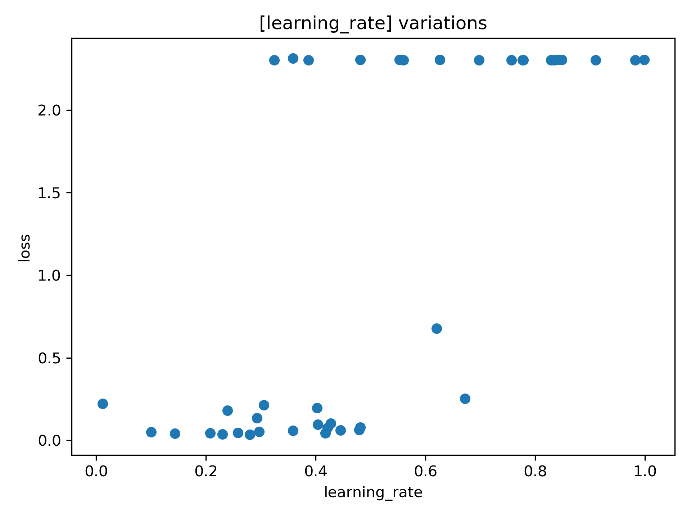

A tour of TRW using the MNIST dataset
*************************************

MNIST dataset
=============

We will be using the MNIST classification task as an example to give an overview of the framework. The purpose 
of this task is to classify a 28x28 white and black image into one of the ten possible digits. We have access to
55,000 training images to train the model parameters, 5,000 images for validation to select the best hyper-parameters
this task and 10,000 images to assess the model.

.. image:: images/mnistdigits.png
    :align: center
    :alt: MNIST examples
    :height: 300px

Specify and train the model
===========================

In this section we define a classification model, but first, let's import commonly required modules:

.. testcode::

	import trw
	import torch.nn as nn
	import torch.nn.functional as F
	import numpy as np

Using the native PyTorch API, we define our model. To specify that a node
should be used as a classification unit, we use the :class:`trw.train.OutputClassification`.
By default it will use the multi-class cross entropy loss:

.. testcode::

	class Net(nn.Module):
		def __init__(self):
			super(Net, self).__init__()
			self.conv1 = nn.Conv2d(1, 20, 5, 2)
			self.fc1 = nn.Linear(20 * 6 * 6, 500)
			self.fc2 = nn.Linear(500, 10)
			self.relu_fc1 = nn.ReLU()
			self.relu_conv1 = nn.ReLU()

		def forward(self, batch):
			# a batch should be a dictionary of features
			x = batch['images'] / 255.0

			x = self.relu_conv1(self.conv1(x))
			x = F.max_pool2d(x, 2, 2)
			x = x.view(x.shape[0], -1)
			x = self.relu_fc1(self.fc1(x))
			x = self.fc2(x)

			# Here we create a softmax output that will use
			# the `targets` feature as classification target
			return {
				'softmax': trw.train.OutputClassification(x, 'targets')
			}

Finally, we can create a :class:`trw.train.Trainer` to start the training and evaluation:

.. testcode::

	# Configure and run the training/evaluation
	options = trw.train.create_default_options(num_epochs=10)
	trainer = trw.train.Trainer()

	model, results = trainer.fit(
		options,
		inputs_fn=lambda: trw.datasets.create_mnist_datasset(),
		run_prefix='mnist_cnn',
		model_fn=lambda options: Net(),
		optimizers_fn=lambda datasets, model: trw.train.create_sgd_optimizers_fn(
			datasets=datasets, model=model, learning_rate=0.1))

	# Calculate statistics of the final epoch
	output = results['outputs']['mnist']['test']['softmax']
	accuracy = float(np.sum(output['output'] == output['output_truth'])) / len(output['output_truth'])
	assert accuracy >= 0.95

Evaluation of the model
=======================

By default `TRW` keeps track of useful information to check input inputa data, evaluate and debug
the model. By default, the following folders will be created:

.. code-block::

	mnist_cnn_r0
		├── random_samples
		├── augmentations
		├── tensorboard
		├── history
		├── lr_recorder
		├── history
		├── worst_samples_by_epoch
		├── errors
		| best_history.txt
		| last.model
		| last.model.result
		| softmax-mnist-test-cm.png
		| softmax-mnist-test-report.txt
		| softmax-mnist-train-cm.png
		| softmax-mnist-train-report.txt
		| trainer.txt
		

Inspecting the input data
-------------------------

The :class:`trw.train.Trainer` will output random samples in `mnist_cnn_r0/random_samples/mnist`. 
Features of a sample that can be natively exported in a meaningful format (e.g., .png for an image). 
For example, `mnist_test_s0_e0.png` will be a random image from the test split:

Other metadata that cannot be exported to a known format will be summarized in a text file. For example, 
`mnist_test_s0_e0.txt` will store metadata such as sample ID, target class:

.. code-block::
	
	targets=5
	sample_uid=6573
	dataset_name=mnist
	split_name=test
	term_softmax_output=6
	targets_str=5 - five

Inspecting the data augmentations
---------------------------------

To make sure the data augmentation is behaving as expected, it is useful to visualize them. By default 
augmentations will be stored in the `mnist_cnn_r0/augmentations/mnist` folder. Internally, 
:class:`trw.train.SequenceArray` will create a unique ID per sample that will be used to keep track
of the augmentations.

Basic Statistics
----------------

At the end of the training, meaningful statistics will be gathered:

* ROC and AUC for binary classification,
* Confusion matrix,
* Accuracy, precision, recall, F1 score, most common errors,
* Evolution of accuracy and losses during the training.

Example errors
--------------

Using the callback :class:`trw.train.CallbackWorstSamplesByEpoch`, a selected number of
samples with errors will be exported. Another useful view is to display the errors by epoch 
using :class:`trw.train.CallbackWorstSamplesByEpoch` and inspect the samples that
are the most frequently classified and in particular in the training split.  These are the 
errors the classifier has the most difficulty assimilating and often reveal the outliers. Here 
is an example below on the train split:

	
    The samples are displayed on the x-axis (one per pixel) and y-axis shows the epochs. `Red` 
    indicates a sample with high loss while yellow indicates samples with low loss. Samples are sorted
    by overall loss.
	
	
Here are the most difficult examples to classify. This can be used quickly identify outliers:

	
    Examples of outliers and annotation mistakes in the original MNIST dataset 
    spotted using :class:`trw.train.CallbackWorstSamplesByEpoch` callback.

Embedding analysis
------------------

:class:`trw.train.CallbackTensorboardEmbedding` allows to export an intermediate tensor (or commonly referred to
as `embedding`) to the tensorboard embedding tab. This can be useful to understand what the model considers as similar
samples and possibly detect common trends.

	
    Embedding of the MNIST dataset displayed using Tensorboard.

Hyper-parameter selection & visualization
-----------------------------------------

Tuning hyper-parameters is one of the crucial steps to train a deep learning model. It is often what makes the difference
between a model that is average and one that is doing magic. The challenge whith hyper-parameters is that they will vary
wildly depending on the task or dataset. One of the most basic tool to optimize hyper-parameters is to use random search.
That is, we will repeat the training of a model a specified numbr of times with hyper-parameters randomly selected for each
training. `TRW` provides an easy mechanism to set up hyper-parameter optimization using 
:class:`trw.hparams.HyperParametersOptimizerRandomSearchLocal`

First, weed to set up the hyper-parameters:

.. testcode::

	def create_net(hparams):
		# create 2 model hyper-parameters
		number_hidden = hparams.create('number_hidden', trw.hparams.DiscreteIntegrer(500, 100, 1000))
		number_conv1_channels = hparams.create('number_conv1_channels', trw.hparams.DiscreteIntegrer(16, 4, 64))

		n = trw.simple_layers.Input([None, 1, 28, 28], 'images')
		n = trw.simple_layers.Conv2d(n, out_channels=number_conv1_channels, kernel_size=5, stride=2)
		n = trw.simple_layers.ReLU(n)
		n = trw.simple_layers.MaxPool2d(n, 2, 2)
		n = trw.simple_layers.Flatten(n)
		n = trw.simple_layers.Linear(n, number_hidden)
		n = trw.simple_layers.ReLU(n)
		n = trw.simple_layers.Linear(n, 10)
		n = trw.simple_layers.OutputClassification(n, output_name='softmax', classes_name='targets')
		return trw.simple_layers.compile_nn([n])

Then we need to specify how to evaluate the hyper-parameters:

.. testcode::

	def evaluate_hparams(hparams):
		learning_rate = hparams.create('learning_rate', trw.hparams.ContinuousUniform(0.1, 1e-5, 1.0))

		# disable most of the reporting so that we don't end up with
		# thousands of files that are not useful for hyper-parameter search
		trainer = trw.train.Trainer(
			callbacks_pre_training_fn=None,
			callbacks_post_training_fn=None,
			callbacks_per_epoch_fn=lambda: [trw.train.callback_epoch_summary.CallbackEpochSummary()])
		
		model, results = trainer.fit(
			options,
			inputs_fn=lambda: trw.datasets.create_mnist_datasset(normalize_0_1=True),
			run_prefix='run',
			model_fn=lambda options: create_net(hparams),
			optimizers_fn=lambda datasets, model: trw.train.create_sgd_optimizers_fn(datasets=datasets, model=model, learning_rate=learning_rate))
		
		hparam_loss = trw.train.to_value(results['outputs']['mnist']['test']['overall_loss']['loss'])
		hparam_infos = results['history']
		return hparam_loss, hparam_infos

Finally, run the parameter search and its analysis:

.. testcode::

	# configure and run the training/evaluation
	options = trw.train.create_default_options(num_epochs=5)
	hparams_root = os.path.join(options['workflow_options']['logging_directory'], 'mnist_cnn_hparams')
	trw.train.utils.create_or_recreate_folder(hparams_root)
	options['workflow_options']['logging_directory'] = hparams_root

	# run the hyper-parameter search
	random_search = trw.hparams.HyperParametersOptimizerRandomSearchLocal(
		evaluate_hparams_fn=evaluate_hparams,
		repeat=40)
	random_search.optimize(hparams_root)

	# finally analyse the run
	hparams_report = os.path.join(hparams_root, 'report')
	trw.hparams.analyse_hyperparameters(
		hprams_path_pattern=hparams_root + '\hparams-*.pkl',
		output_path=hparams_report)

This will perform 40 training with random parameters and outputs a report. We can use these trainings to estimate
the importance of the hyper-parameters. It is an important indicator as often, many of the
hyper-parameters have little influence on the model performance. This hyper-paramater
weighting indicates which hyper-parameters we should focus the search on:

	
    Hyper-parameter importance. This indicates the dominant hyper-parameters and allows
    us to discard the hyper-parameters that do not influence much the model
	

The hyper-parameters can be displayed relative to the loss and maybe we can gain
additional insights:

	
    Here we can see that when the learning rate is set too high, the model more often
    performs poorly than with lower the learning rates.

Import parameters to optimize are learning rate, batch size or model parameters (e.g., activation function, 
number of convolutional filters, filter size, number of layers).

Archtecture search
------------------
TBD

Model Export
------------

Finally, the model is stored as PyTorch model and exported to a `onnx` format. This allows interoperability
between major deep learning frameworks (e.g., for production).