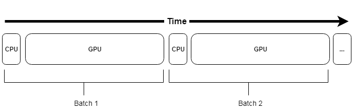
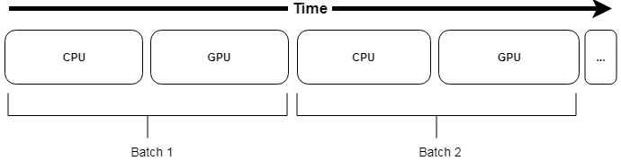
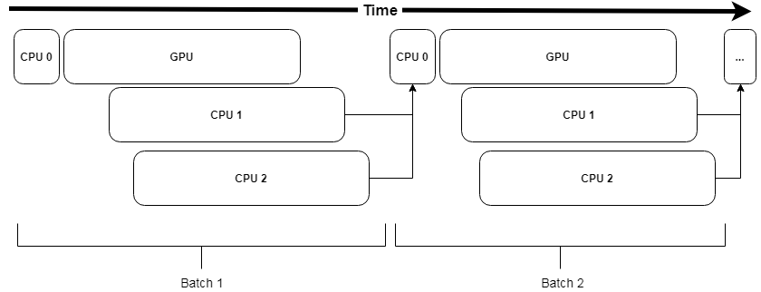
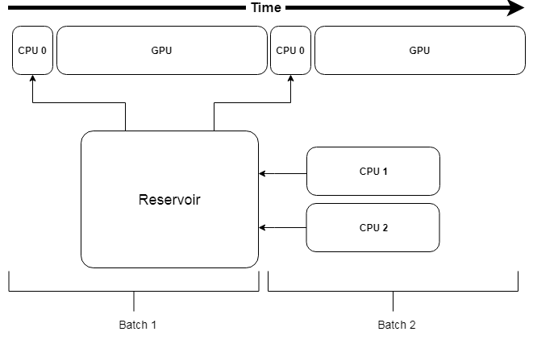

Input pipeline
**************

:class:`trw.train.SequenceArray`
================================

To fully utilize our GPU to train a deep learning model, it is required the data is efficiently processed and sent to the GPU. If the input pipeline is not
optimized, the training will be unnecessarily time consuming and as such is a critical component to have set up appropriately.

The simplest way to feed data to the GPU is to use :class:`trw.train.SequenceArray`. This sequence assumes the data can be fully stored in RAM. This is also a relatively
fast way to feed the data since it is readily available. The only overhead being transfer of the data from RAM to the GPU.

    
    Representation of a pipeline using :class:`trw.train.SequenceArray`. CPU time mostly involve fetching the data from RAM and its transfer to the GPU

However, this is often not a realistic use case and in particular for deep learning models that often require large amount of data. Another requirement
of a pipeline is to be able to perform efficiently data augmentation. Data augmentation may account for a significant processing time which will limit the
GPU utilization.

    
    Representation of a pipeline using :class:`trw.train.SequenceArray`, with data augmentation. This is problematic since the augmentation may account for a large processing time, limiting the GPU utilization.
	
	
:class:`trw.train.SequenceMap`
==============================

One way to make the data augmentation performant is to overlap the CPU (e.g., preprocessing & data augmentation) with the GPU (e.g., model training). This can be done using :class:`trw.train.SequenceMap`,
which will use a pool of process workers to perform the processing (CPUn) while the main thread will orchestrate the background jobs.

    
    Representation of a pipeline using :class:`trw.train.SequenceMap`. CPU0 orchestrates the background processes CPU1 & CPU2 to perform the processing. In case the processing takes time, CPU0 will need to wait for the workers to have processed the next batch of data.
	
One potential issue with this method is the overhead required to orchestrate the background workers and more importantly, we will have to wait if the next batch of data is not ready. Finally, setting up the pipeline
may not be straightforward as it depends on the specific configuration (GPU time, CPU time, number of CPU cores).

:class:`trw.train.SequenceAsyncReservoir`
=========================================

:class:`trw.train.SequenceMap` will stall the pipeline in case the CPU is not fast enough to calculate the next batch of data. To avoid this problem, :class:`trw.train.SequenceAsyncReservoir` uses a reservoir of
processed samples that can be directly sent to GPU even if the next batch is not available. In the background, process workers will process the data and fill the reservoir, slowly replacing the content
of the reservoir over time.

    
    Representation of a pipeline using :class:`trw.train.SequenceAsyncReservoir`. The data augmentation is performed by workers that will fill a reservoir. The next batch of data is sampled from the reservoir and avoid stalling the pipeline.

Examples of pipelines
=====================
